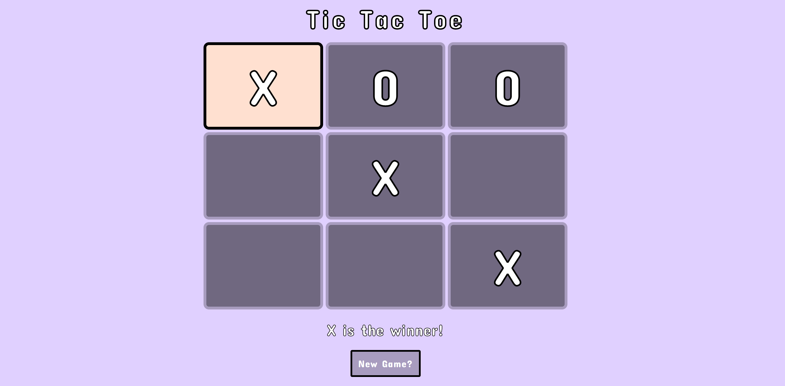

# Tic-Tac-Toe

Live Code: https://kimflores-tictactoe.netlify.app

# How It's Made:
### Tech used: 
Wrote up pseudo code and had to think about how make procedural JS into OOP. 

# Lessons Learned:
Organization and writing comments within my code helped me to have a better understanding of all the moving parts within the JS. I gained a better understanding of JS and how OOP can make the code look more organized and reusable through out. Want to practice more with OOP.

# Examples:

Take a look at these couple examples that I have in my own portfolio:

To-Do List: https://github.com/Kim-Flores/todo-list-2019-week05/tree/answer

Horoscope: https://github.com/Kim-Flores/Horoscope

Calculator: https://github.com/Kim-Flores/Simple-Calculator

Parchment Stone or Blade: https://github.com/Kim-Flores/Parchment-Stone-Blade
